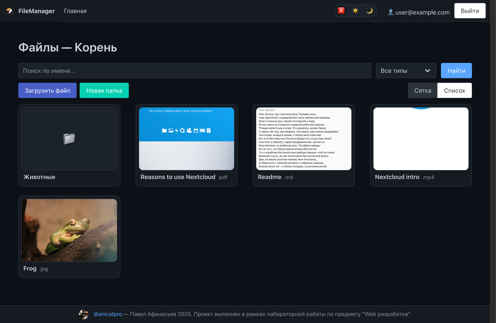
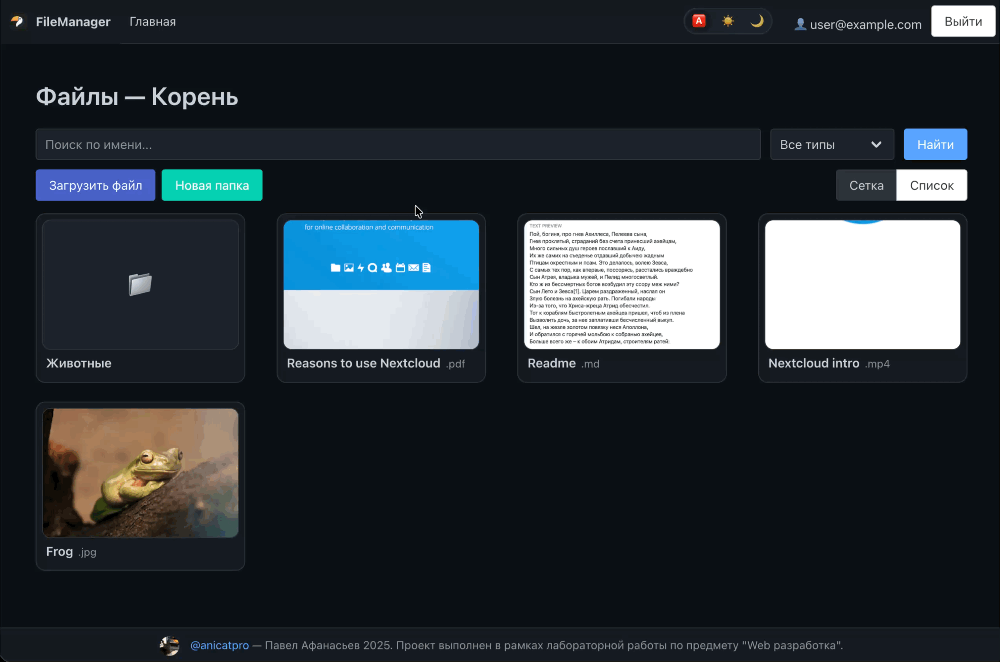
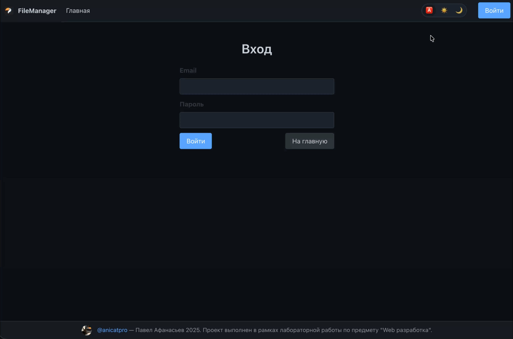
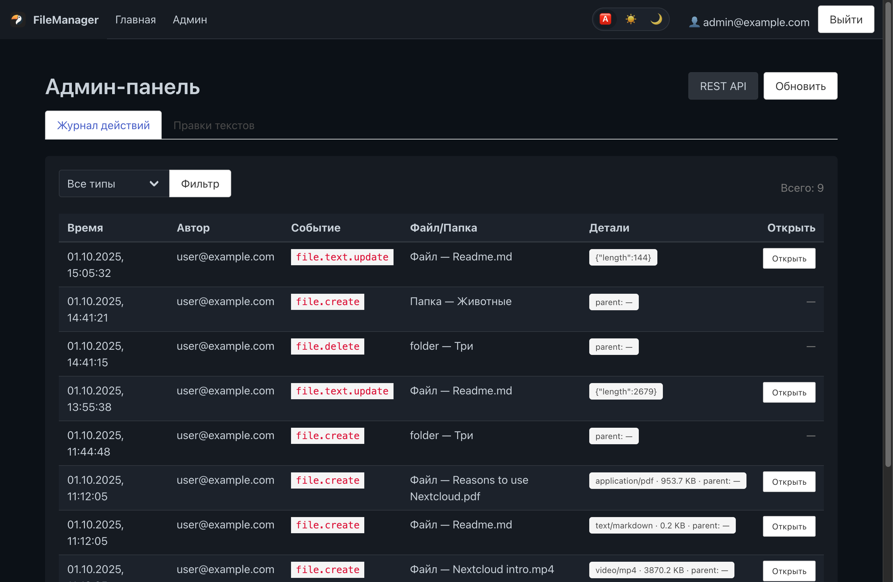
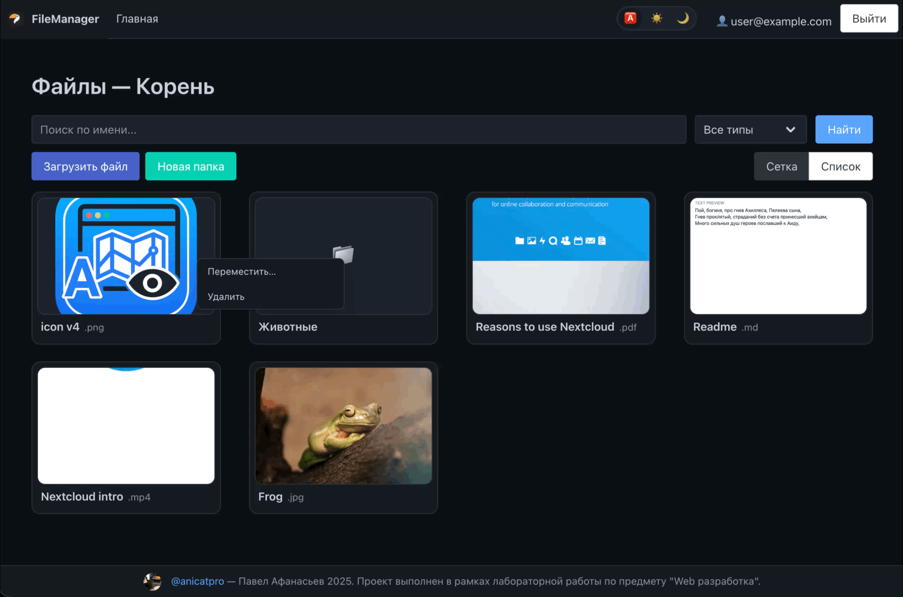
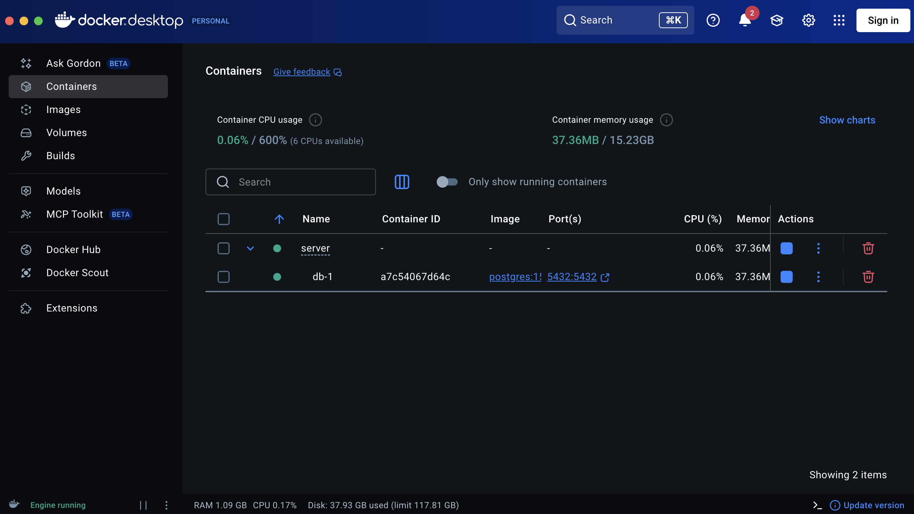

> [!TIP]
> Проект выполнен в рамках двух лабораторных работ по предмету "Web-разработка". Вариант 2.

  <h1>
    
    FileManager
  </h1>

Приложение представляет собой файловый менеджер некоторого облачного
хранилища.

## Функционал

| Client (Frontend)                                                                      | Server (Backend)                                |
|----------------------------------------------------------------------------------------|-------------------------------------------------|
| [На главной странице отображается список файлов и папок корня хранилища](list-files)   | [REST API - Swagger-документация](rest-api)     |
| [Пользователь может открыть страницу папки и посмотреть её содержимое](finder-display) | API проверяет правильность ввода входных данных |
| [Поиск папок и файлов](search-files_finder)                                            | Фильтрация и поиск объектов                     |
| [Фильтрация файлов](type-file)                                                         | [SQL — PostgreSQL](docker-sql)                  |
| [Реализован виджет просмотра файла](widget-file)                                       | Разграничение хранилища между admin и user      |
| [Редактирование текстовых файлов с сохранением на сервере](edit-file)                  | Хеширование паролей в SQL                       |
| [Страница входа](login-user)                                                           | Bearer-токены                                   |
| [Панель администратора](admin-panel)                                                   |                                                 |
| [Переключение дневной и ночной темы](theme)                                            |                                                 |
| [Drag-and-drop](drop)                                                                  |                                                 |
| [Отображение файлов сеткой или списком](grid-list)                                     |                                                 |
| [Перемещение файла в папку перетаскиванием](move-drop)                                 |                                                 |

### Client (Frontend)

#### Отображения списка файлов и папок корня хранилища

#### Открытие папки и просмотр ее содержимого

#### Поиск папок и файлов

#### Фильтрация файлов

#### Виджет просмотра файла

#### Редактирование текстовых файлов

#### Страница входа

#### Панель администратора

#### Темы

#### Drag-and-drop

#### Отображение файлов сеткой или списком

#### Перемещение файла в папку перетаскиванием

### Server (Backend)

#### Swagger-документация (REST-API)

#### SQL — PostgreSQL
